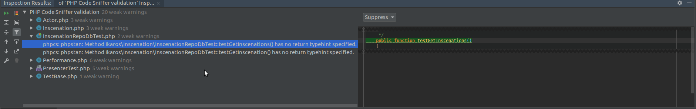

# Abandoned
no more needed phpstorm support phpsan now (EAP 2020.3). https://blog.jetbrains.com/phpstorm/2020/07/phpstan-and-psalm-support-coming-to-phpstorm/

phpStanCs
=========
This is small hack, that allows you to fob off the phpStan report into phpStorm as a PHP code sniffer.
This is not really good solution, but i don't know Java and this wos easier for me.
This is for now, till plugin would be created. I heard somewhere, that somebody may working on it.




## Install
You need composer https://getcomposer.org/
Than go to project directory and run in console
```bash
composer require --dev matla/phpstancs 
```

## Usage and settings 
### PhpStorm settings
Open File->Settings->Language & Frameworks -> PHP -> Quality Tools -> Code Sniffer
and set path to __vendor/matla/phpstancs/bin/phpcs__

You also need allowed inspection from phpcs

### PhpStan and PhpStanCS setup
Config phpStan is possible only by file phpstan.neon 
in root directory of project (location of composer.json).
If file like this exist, than you must install this extension 
either automatically using "phpstan/extension-installer" or by including in your phpstan.neon.  
eg.
```neon
includes:
	- vendor/matla/phpstancs/extension.neon
```  
Settings for phpStanCs are in same file. 
It is parameter runCS (bool), which turn on/of phpcs inspection which is marget with php stan results.
```neon
parameters:
    phpstancs:
	    runCS : true
```

## Authors
* Adam Mátl <code@matla.cz>
