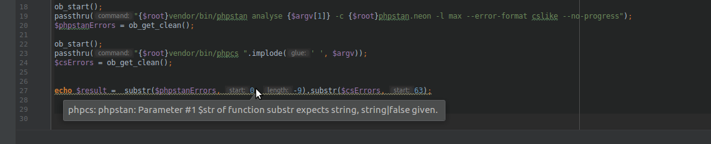
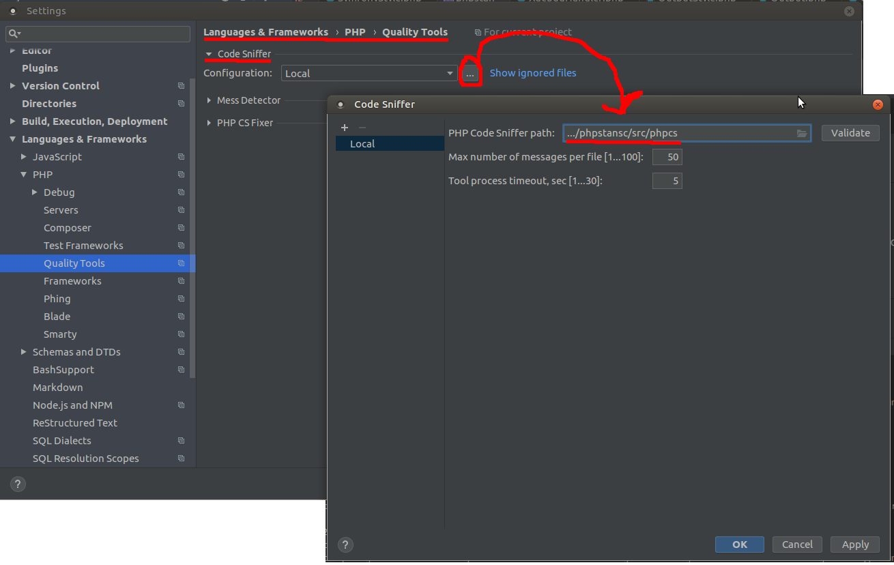
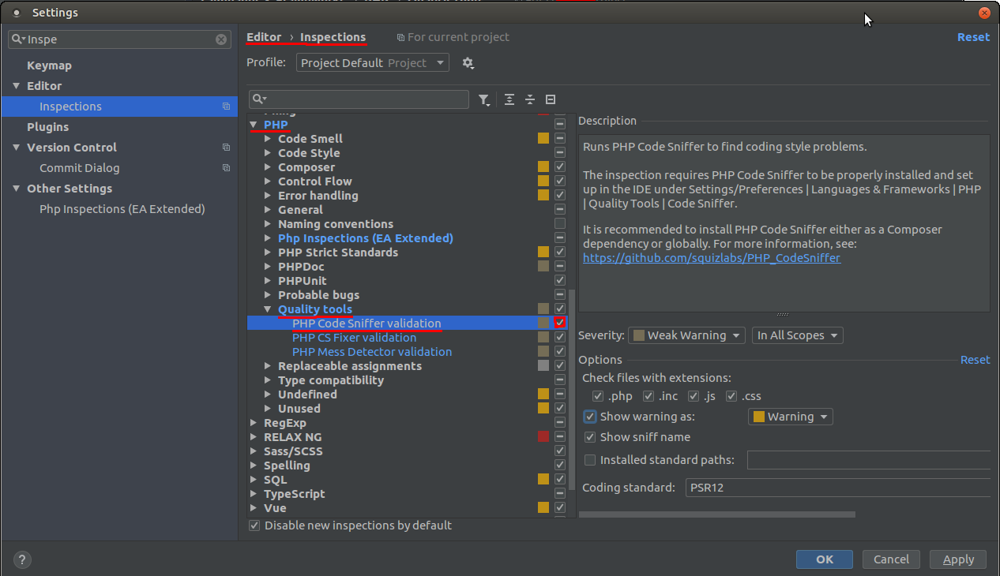

phpstansc
=========
Slouží k podstrčení phpStanu phpStormu jako phpcs



## Instalace

Do composer.jsom přidej 
```json5
"repositories": [
        {
            "type": "vcs",
            "url": "https://github.com/matlad/phpstansc"
        }
    ],
```
a pak už jen
```bash
composer require matla/phpstansc 
```

## Použití 
### Nastavení phpStormu
File->Settings->Language & Frameworks -> PHP -> Quality Tools -> Code Sniffer
a nastavit cestu k vendor/matla/phpstancs/bin/phpcs  

taky je potřeba mýt povolenou inspekci od phpcs


## Authors
* Adam Mátl <code@matla.cz>
